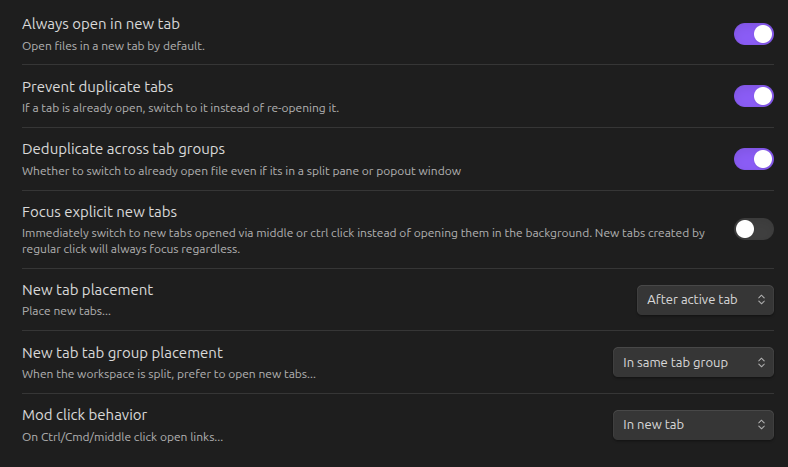

# Open Tab Settings [](https://github.com/jesse-r-s-hines/obsidian-open-tab-settings/actions/workflows/test.yaml)

This plugin adds settings to customize how Obsidian opens tabs and navigates between files, including options to:
- open in new tab by default
- switch to existing tab instead of opening a duplicate file
- customize new tab placement and order
- open new tabs in the opposite pane when using a split workspace

Using these settings can enable a more familiar workflow for those used to working in editors like VSCode. With the "Always open in new tab" toggled, Obsidian will always open files in a new tab, whether they were opened via links, the quick switcher, file explorer, etc. Never accidentally lose your tabs again!

## Features


The primary settings can also be toggled via commands.

## Comparison with similar plugins
There are several plugins that attempt to solve this problem with different pros and cons. However, most other options either only work in specific menus or have a noticeable timer delay before opening new tabs. "Open Tab Settings" works by patching some of Obsidian's internal methods to achieve consistent and seamless new tab and de-duplication behavior throughout Obsidian. It is inspired by the [Opener](https://github.com/aidan-gibson/obsidian-opener) plugin which worked in a similar way, but is no longer maintained and broken on the latest Obsidian (though it has since been [forked](https://github.com/lukemt/obsidian-opener)). "Open Tab Settings" also adds a few improvements over Opener, including making non-file views such as the Graph View also open in new tabs and adding several customization options for new tab placement.

## Plugin compatibility
Open Tab Settings should be compatible with most other plugins, if you encounter any plugin incompatibility problems please submit an issue.

Some known plugin interactions:
- The [PDF++](https://github.com/RyotaUshio/obsidian-pdf-plus) plugin customizes the opening behavior of PDFs which can override Open Tab Setting's behavior. You can make the plugins play nicely together by setting the "How to open..." options to "new tab" in the PDF++ settings.


## Contributing
You can build the plugin with:
```shell
npm install
npm run build
```

This plugin has end-to-end tests using [wdio-obsidian-service](https://github.com/jesse-r-s-hines/wdio-obsidian-service)
and [WebdriverIO](https://webdriver.io/).
Run them with:
```shell
npm run test
```
This will automatically download the latest Obsidian version and test the plugin against it.
