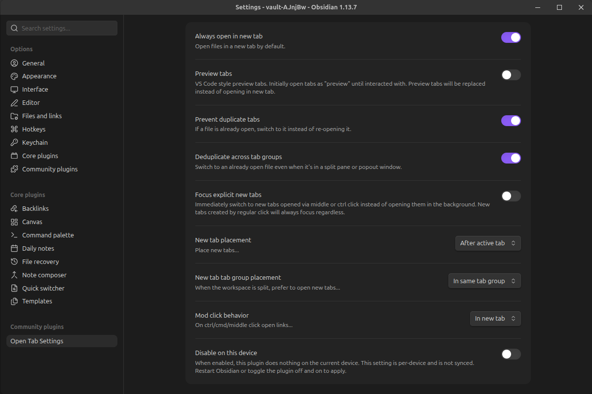
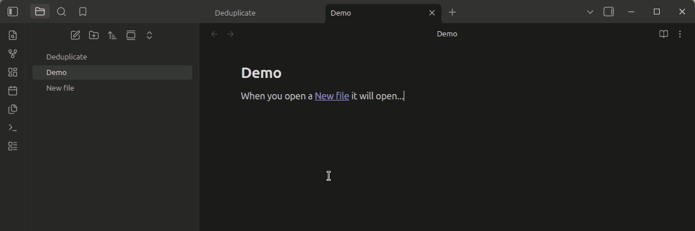
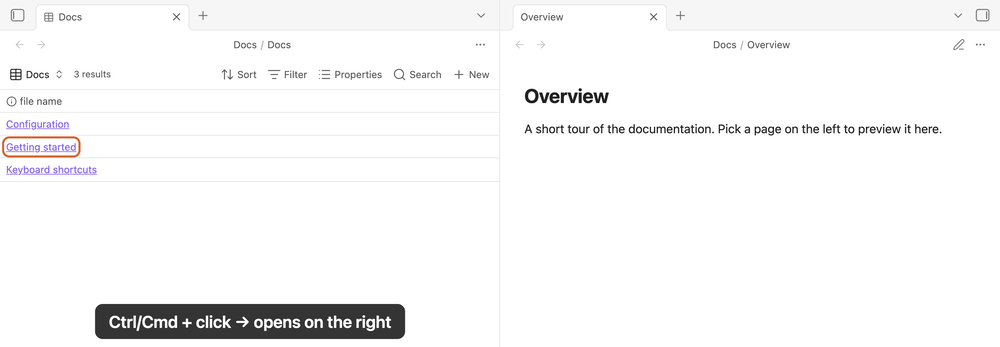

# Open Tab Settings
[](https://github.com/jesse-r-s-hines/obsidian-open-tab-settings/actions/workflows/test.yaml)

This plugin adds settings to customize how Obsidian opens tabs and navigates between files, including options to:
- open in new tab by default
- switch to existing tab instead of opening a duplicate file
- open new tabs in the opposite pane when using a split workspace
- and more!

Using these settings can enable a more familiar workflow for those used to working in editors like VSCode. With the "Always open in new tab" toggled, Obsidian will always open files in a new tab, whether they were opened via links, the quick switcher, file explorer, etc. Never accidentally lose your tabs again!

## Features


All features can be disabled and customized in the settings to tweak Obsidian's behavior to your liking.

- Always open in new tab
    - Open files in a new tab by default.
- Preview tabs
    - VS Code style preview tabs. Initially open tabs as "preview" until interacted with. Preview tabs will be replaced instead of opening in new tab.
- Prevent duplicate tabs
    - If a file is already open, switch to it instead of re-opening it.
- Deduplicate across tab groups
    - Switch to an already open file even when it's in a split pane or popout window.
- Focus explicit new tabs
    - Immediately switch to new tabs opened via middle or ctrl click instead of opening them in the background. New tabs created by regular click will always focus regardless.
- New tab placement
    - Place new tabs after active tab, after pinned tabs, at the beginning, or at the end.
- New tab tab group placement
    - When the workspace is split, prefer to open new tabs in the first tab group, in the last tab group, in the opposite tab group, or in the same tab group.
- Mod click behavior
    - Customize what Ctrl/Cmd/middle click does.

The primary settings can also be toggled via commands.

## Demos

### Open in new tab and deduplicate

With **Always open in new tab** on and **Prevent duplicate tabs** on (the default), you can get behavior like this:



### Side preview pane

Keep a second pane on the side for previewing linked notes, like VS Code's side preview. Mod-clicking a link opens it in that pane, and the next mod-click reuses it instead of creating a new split each time:

- **Mod click behavior**: *In opposite tab group*
- **Preview tabs**: on
- **Always open in new tab**: off, so regular clicks keep opening in the current tab. You can also turn this on if you want links to open in the side pane by default.

With a two-pane split, ctrl/cmd-clicking a link in either pane opens the note in the other one as a preview tab (italic title). The next ctrl/cmd-click replaces that preview, and interacting with the tab (editing it or double-clicking its header) makes it persistent.



## Comparison with similar plugins
There are several plugins that attempt to solve this problem with different pros and cons. However, most other options either only work in specific menus or have a noticeable timer delay before opening new tabs. "Open Tab Settings" works by patching some of Obsidian's internal methods to achieve consistent and seamless new tab and de-duplication behavior throughout Obsidian. It is inspired by the [Opener](https://github.com/aidan-gibson/obsidian-opener) plugin which worked in a similar way, but is no longer maintained and broken on the latest Obsidian (though it has since been [forked](https://github.com/lukemt/obsidian-opener)). "Open Tab Settings" also adds a few improvements over Opener, including making non-file views such as the Graph View also open in new tabs and adding several customization options for new tab placement.

## Plugin compatibility
Open Tab Settings should be compatible with most other plugins, if you encounter any plugin incompatibility problems please submit an issue.

Some known plugin interactions:
- The [PDF++](https://github.com/RyotaUshio/obsidian-pdf-plus) plugin customizes the opening behavior of PDFs which can override Open Tab Setting's behavior. You can make the plugins play nicely together by setting the "How to open..." options to "new tab" in the PDF++ settings.

## Contributing
Clone the repository and build the plugin with:
```shell
npm install
npm run build
```

This plugin has end-to-end tests using [wdio-obsidian-service](https://github.com/jesse-r-s-hines/wdio-obsidian-service)
and [WebdriverIO](https://webdriver.io/). Run them with:
```shell
npm run test
```

If you'd like to help with translating, just add a new locale file under `src/locales`.
